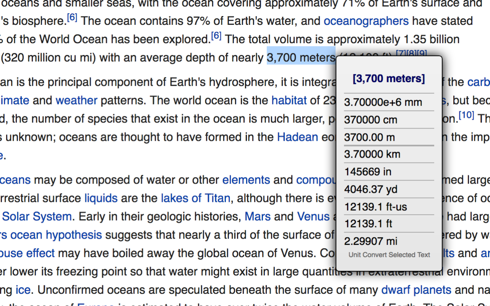
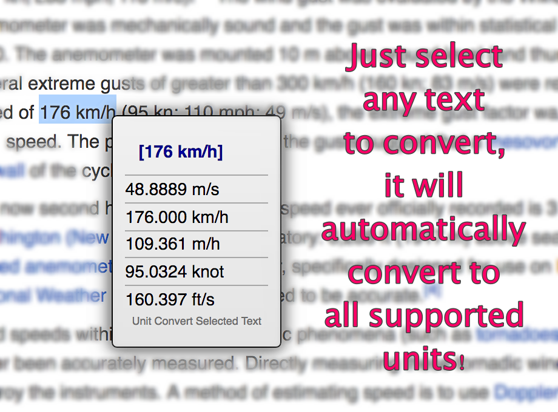

Unit Convert Selection
=======================

A chrome extension which instantly converts unit from your selected text in any web pages.

## Screenshots

This is how the chrome extension works like when you select "3,700 meters" in a web page:

## About Unit Conversion

The unit conversion is done entirely by [convert-units](https://github.com/ben-ng/convert-units) by Ben Ng. 

[Lodash](http://lodash.com) each()/keys() are also used by convert-units so it's included in this project as a custom build min js file.

